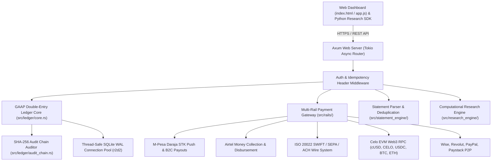

# Lumen Fintech System — Rust System Architecture & Ledger Specification

## 1. Executive Summary

Lumen Finance is engineered as a high-performance, local-first computational finance platform and Web3 crypto engine in **Rust**. Operating on `Axum`, `Tokio`, and `rusqlite`/`r2d2`, Lumen replaces traditional double-precision floating-point ledger arithmetic with **128-bit fixed-point precision (`rust_decimal`)**, eliminating floating-point rounding errors and zero-drift drift.

The core ledger enforces strict **GAAP/IFRS-compliant Double-Entry Bookkeeping** backed by an immutable **SHA-256 Cryptographic Audit Hash Chain**.

Every monetary movement generates balanced debits and credits ($\sum \text{Debits} \equiv \sum \text{Credits}$), preventing unrecorded fund creation, race conditions, or undetected database modification.

---

## 2. High-Level System Architecture



---

## 3. Double-Entry Accounting Core & 128-Bit Precision

### Fundamental Accounting Equation
$$\text{Assets} = \text{Liabilities} + \text{Equity} + (\text{Revenue} - \text{Expenses})$$
$$\sum \text{Debits} \equiv \sum \text{Credits}$$

Every financial transaction is executed as an atomic `journal_entry` containing at least two postings.

### Normal Balance Matrix
| Classification | Normal Balance | Increase Direction | Decrease Direction | System Examples |
| :--- | :--- | :--- | :--- | :--- |
| **Asset** | Debit | Debit | Credit | `acc_bank_operating`, `acc_crypto_cusd`, `acc_mpesa` |
| **Liability** | Credit | Credit | Debit | `liability:credit_card`, `liability:loan` |
| **Equity** | Credit | Credit | Debit | `equity:opening_balance`, `equity:retained_earnings` |
| **Revenue** | Credit | Credit | Debit | `revenue:Salary`, `revenue:Sales`, `revenue:Yield` |
| **Expense** | Debit | Debit | Credit | `expense:Cloud Services`, `expense:Utilities`, `expense:Payroll` |

---

## 4. Cryptographic SHA-256 Audit Chain & Immutability

Lumen integrates SHA-256 hash chaining across all journal entries:

$$H_0 = \text{SHA256}(\text{"GENESIS\_LUMEN\_FINTECH\_CRYPTOGRAPHIC\_LEDGER\_CHAIN\_2026"})$$
$$H_n = \text{SHA256}(H_{n-1} \parallel \text{Seq} \parallel \text{EntryID} \parallel \text{Date} \parallel \text{Description} \parallel \text{SortedPostingsJSON})$$

- If any record, amount, or direction in `journal_entries` or `postings` is altered, recalculating the hash chain from genesis flags the corrupted sequence block.
- Verified in milliseconds via `GET /api/ledger/verify-audit` or `verify_audit_chain(&conn, user_id)` in Rust.

---

## 5. Payment Rails & Celo Web3 Crypto Gateway

1. **M-Pesa Rail (`src/rails/mpesa.rs`)**: Direct integration with Safaricom Daraja API for STK Push C2B top-ups and B2C automated payouts.
2. **Airtel Money Rail (`src/rails/airtel.rs`)**: Cross-border East African mobile money collections (KES/UGX) and cashouts.
3. **Bank Transfer Wire Rail (`src/rails/bank_transfer.rs`)**: ISO 20022 wire messaging supporting SWIFT ($25 fee, 24h settlement), SEPA (€2 fee, 4h settlement), and ACH ($0 fee, 12h settlement).
4. **Celo EVM Web3 Crypto Rail (`src/rails/crypto.rs`)**:
   - Native EVM Web3 RPC support (`cUSD`, `CELO`, `USDC`, `BTC`, `ETH`).
   - Ultra-low gas fees (~$0.001 per transaction).
   - $0.01 minimum deposit threshold enforcement.
   - Fiat on-ramp / off-ramp exchange buy/sell orders and instant DEX swaps.
5. **Fintech Gateway Rail (`src/rails/fintech_gateway.rs`)**: Multi-currency payment links and instant P2P payouts across Wise, Revolut, PayPal, and Paystack.

---

## 6. Computational Research Engine

- **Cash Flow Forecast (`src/research_engine/forecast.rs`)**: 30/60/90-day linear regression and double exponential smoothing with dynamic confidence bands.
- **Monte Carlo Risk Simulation (`src/research_engine/monte_carlo.rs`)**: Stochastic Box-Muller normal distribution modeling for revenue volatility, expense shocks, and insolvency probability.
- **Financial Health Score (`src/research_engine/health_score.rs`)**: Altman Z-Score and corporate liquidity diagnostic engine (0-100 rating & letter grade AAA to CCC).
- **Fraud Anomaly Detector (`src/research_engine/anomaly_detector.rs`)**: Z-Score statistical outlier detection for unexpected cash drain.

---

## 7. Rust Module Organization

```
src/
├── config.rs              # System configuration & env loading
├── db.rs                  # SQLite WAL connection pooling (r2d2) & schema initialization
├── lib.rs                 # Library export root
├── main.rs                # Axum HTTP server entrypoint
├── middleware/            # Auth & security headers middleware
├── ledger/
│   ├── audit_chain.rs     # SHA-256 cryptographic auditor
│   ├── chart_of_accounts.rs # GAAP/IFRS normal balance matrix & trial balance
│   ├── core.rs            # 128-bit rust_decimal double-entry core
│   └── mod.rs
├── rails/
│   ├── airtel.rs          # Airtel Money API connector
│   ├── bank_transfer.rs   # SWIFT / SEPA / ACH wire connector
│   ├── crypto.rs          # Celo EVM Web3 RPC & exchange engine
│   ├── fintech_gateway.rs # Wise, Revolut, PayPal, Paystack gateway
│   ├── mpesa.rs           # M-Pesa STK Push & B2C payout connector
│   └── mod.rs
├── research_engine/       # Forecast, Monte Carlo, Health Score, Anomalies
├── statement_engine/      # CSV/OFX parser & SHA-256 deduplicator
└── routes/                # Axum REST API handlers
```
